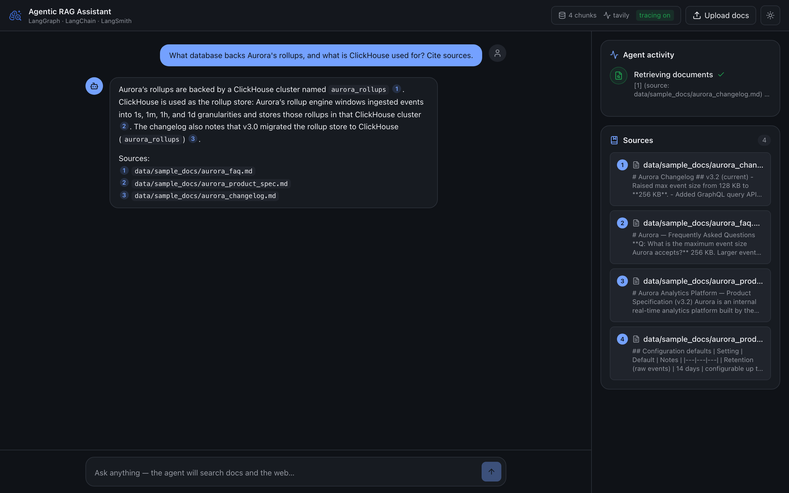
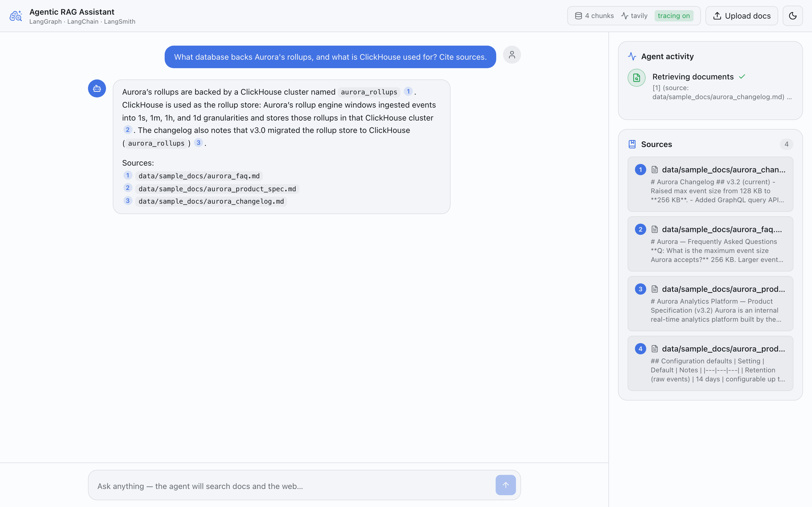
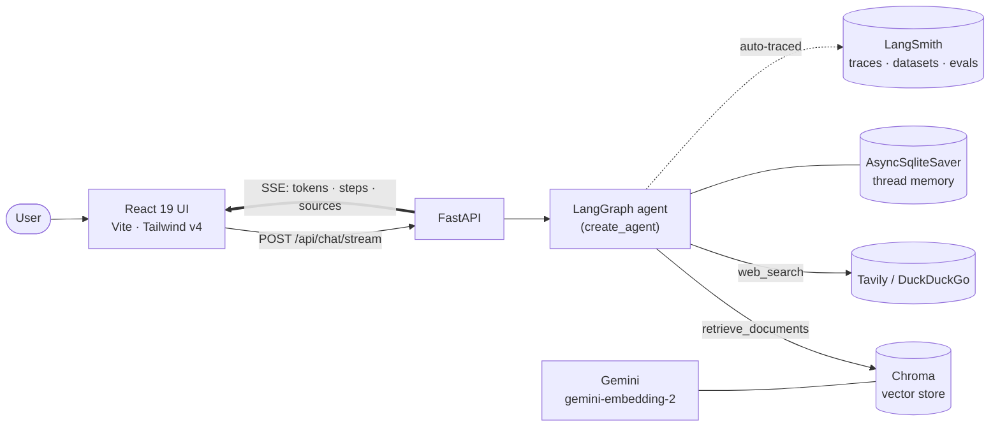
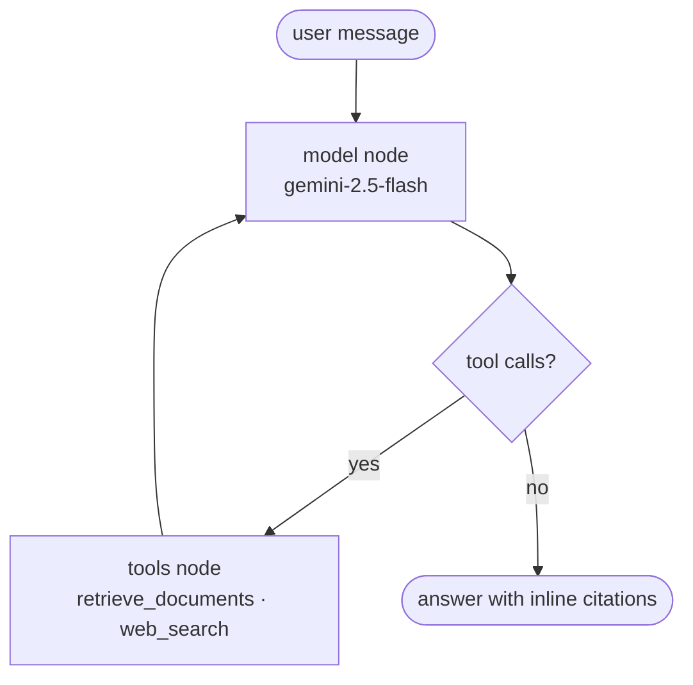
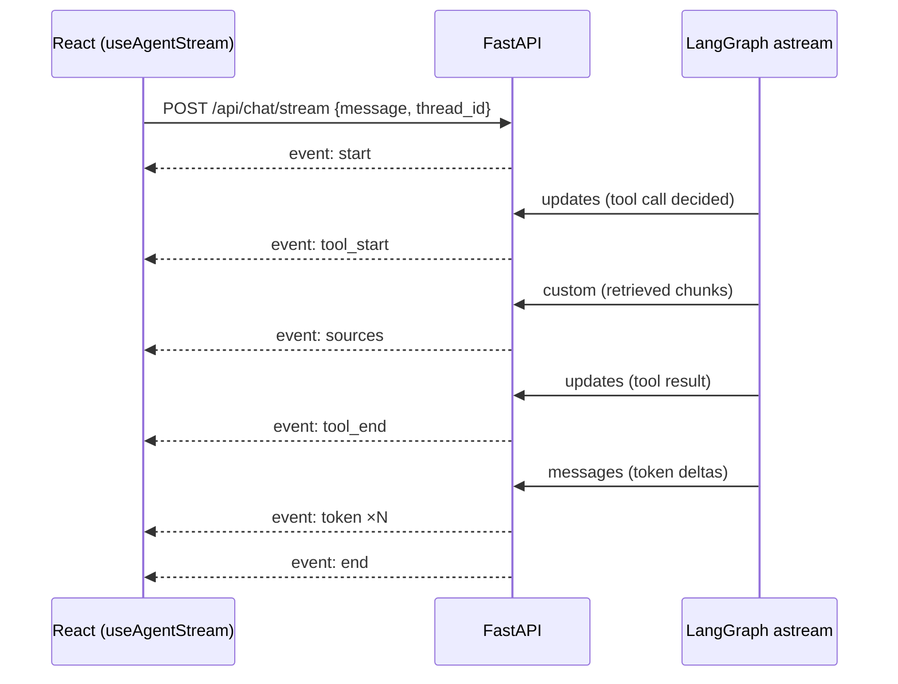

<div align="center">

# 🧠 Agentic RAG Assistant

### An agent that researches your documents **and** the live web — streaming every token and every step to a polished React UI, fully traced and evaluated in LangSmith.

[](https://www.python.org/)
[](https://fastapi.tiangolo.com/)
[](https://python.langchain.com/)
[](https://langchain-ai.github.io/langgraph/)
[](https://smith.langchain.com/) <br/>
[](https://react.dev/)
[](https://www.typescriptlang.org/)
[](https://tailwindcss.com/)
[](https://www.docker.com/)
[](./LICENSE)

<br/>



</div>

---

A production-shaped demo of an **agentic RAG** system built on **LangChain + LangGraph + LangSmith**. A LangGraph agent plans, calls tools (vector retrieval over your documents and live web search), and synthesizes an answer with inline citations. Both the answer tokens **and** the agent's intermediate steps stream to a React 19 UI over Server-Sent Events, while every run is automatically traced and offline-evaluated in LangSmith.

## ✨ Highlights

* 🤖 **Agentic loop, not a fixed chain** — a LangGraph `create_agent` ReAct agent decides when to retrieve documents, when to search the web, and when it has enough to answer.
* 📚 **Dual retrieval** — RAG over a persisted Chroma vector store **+** live web search (Tavily, with a keyless DuckDuckGo fallback).
* ⚡ **Streams tokens *and* steps** — a custom multi-channel `astream` → SSE bridge surfaces token deltas, tool start/stop, and retrieved sources in real time.
* 🪄 **SOTA UI** — React 19 + Vite + Tailwind v4: live agent-activity timeline, clickable `[n]` citation chips, drag-and-drop ingestion, markdown + syntax-highlighted answers, dark mode.
* 🔬 **Real evaluation suite** — a LangSmith dataset scored by LLM-as-judge correctness, RAG groundedness & retrieval-relevance, and a citation heuristic, plus a pairwise model comparison.
* 🐳 **One command to run** — `docker compose up` brings up the backend and a single-origin nginx-served frontend.

## 🖼️ Screenshots

| Light                                         | Dark                                         |
| --------------------------------------------- | -------------------------------------------- |
|  |  |

The right-hand inspector shows the **agent activity timeline** (each tool call with running → done state) and the **sources** panel; inline `[1]`,`[2]` chips in the answer jump to the matching source card.

## 🏗️ Architecture



### Agent control flow (the ReAct loop)



`create_agent` compiles exactly this graph. It loops the model ↔ tools edge until the model emits a final answer with no further tool calls — that is the "agentic" behaviour, as opposed to a one-shot retrieve-then-generate chain.

### Streaming contract

The backend runs `agent.astream(stream_mode=["messages", "updates", "custom"])` and maps each channel to a flat SSE event the frontend can consume without knowing any LangGraph internals.



| Event        | Channel    | Payload                                                           |
| ------------ | ---------- | ----------------------------------------------------------------- |
| `start`      | —          | `{ thread_id }`                                                   |
| `token`      | `messages` | `{ delta, node }` — incremental answer text                       |
| `tool_start` | `updates`  | `{ id, tool, args }`                                              |
| `tool_end`   | `updates`  | `{ id, tool, ok, result_preview }`                                |
| `sources`    | `custom`   | `{ tool, sources: [{ id, kind, title, url?, snippet, score? }] }` |
| `error`      | —          | `{ message, fatal }`                                              |
| `end`        | —          | `{ thread_id }`                                                   |

## 🧰 Tech stack

| Layer                     | Stack                                                                                                               |
| ------------------------- | ------------------------------------------------------------------------------------------------------------------- |
| **Agent / orchestration** | LangGraph 1.2 (`create_agent`, `AsyncSqliteSaver`), LangChain 1.3                                                   |
| **LLMs**                  | Google Gemini **`gemini-2.5-flash`** (routine + synthesis); `gemini-embedding-2` |
| **Retrieval**             | Chroma 1.5 (persisted) · `RecursiveCharacterTextSplitter` · Tavily / DuckDuckGo                                     |
| **Observability**         | LangSmith 0.8 tracing · `openevals` LLM-as-judge                                                                    |
| **Backend**               | FastAPI · `sse-starlette` · pydantic-settings · uv · Python 3.12                                                    |
| **Frontend**              | React 19 · Vite 8 · TypeScript 6 · Tailwind v4 · Shiki · lucide-react                                               |
| **Delivery**              | Docker Compose (backend + nginx single-origin proxy)                                                                |

## 🚀 Quickstart

Clone this repository using its GitHub URL:

```bash
git clone <https://github.com/UtkarshRai14/agentic-rag-assistant>
cd agentic-rag-assistant
cp .env.example .env
```

Fill in the required environment variables, including `GOOGLE_API_KEY`. `TAVILY_API_KEY` and the LangSmith variables are optional.

### Docker (recommended)

```bash
export GOOGLE_API_KEY=...
docker compose up -d --build
# UI:   http://localhost:8080
# API:  http://localhost:8000/api/health
docker compose logs -f backend
docker compose down
```

The frontend container serves the built UI and proxies `/api` to the backend, so everything is single-origin — no CORS.

### Local dev

```bash
# backend
uv sync
uv run uvicorn rag_agent.api:app --reload          # :8000

# frontend (separate terminal)
cd frontend && npm install && npm run dev          # :5173, proxies /api → :8000
```

On first boot the backend ingests `data/sample_docs/` (a fictional "Aurora" analytics platform) into a persisted Chroma store. Add your own PDF/TXT/Markdown via the **Upload docs** button.

## ⚙️ Configuration

<details>
<summary>Environment variables</summary>

| Variable            | Required | Default                  | Purpose                                                |
| ------------------- | -------- | ------------------------ | ------------------------------------------------------ |
| `GOOGLE_API_KEY`    | ✅        | —                        | Gemini LLMs + embeddings                              |
| `TAVILY_API_KEY`    | ➖        | —                        | Web search (falls back to keyless DuckDuckGo if unset) |
| `LANGSMITH_TRACING` | ➖        | `false`                  | Master switch for tracing                              |
| `LANGSMITH_API_KEY` | ➖        | —                        | LangSmith auth (tracing + evals)                       |
| `LANGSMITH_PROJECT` | ➖        | `resume-demo-rag-agent`  | Trace project name                                     |
| `MODEL_FAST`        | ➖        | `gemini-2.5-flash`       | Routine-step model                                     |
| `MODEL_HEAVY`       | ➖        | `gemini-2.5-flash`       | Planning / synthesis model                             |
| `EMBEDDING_MODEL`   | ➖        | `gemini-embedding-2`     | Embeddings                                             |
| `VITE_API_URL`      | ➖        | same-origin              | Deployed backend URL (frontend build-time setting)     |
| `RETRIEVER_K`       | ➖        | `4`                      | Chunks retrieved per query                             |

</details>

## 🔌 API

| Method | Path               | Description                                            |
| ------ | ------------------ | ------------------------------------------------------ |
| `GET`  | `/api/health`      | models, web backend, tracing flag, indexed-chunk count |
| `POST` | `/api/ingest`      | multipart upload → `{ chunks_added, files }`           |
| `POST` | `/api/chat/stream` | SSE stream (see the streaming contract above)          |
| `POST` | `/api/feedback`    | forward a thumbs up/down score to LangSmith            |

```bash
curl -N -X POST http://localhost:8000/api/chat/stream \
  -H 'Content-Type: application/json' \
  -d '{"message":"What auth does Aurora use, and what is mTLS? Cite sources."}'
```

## 🔬 Observability & Evaluation (LangSmith)

Tracing turns on automatically when `LANGSMITH_TRACING=true` and `LANGSMITH_API_KEY` are set — every LLM call, tool call, and graph node is captured as one nested trace with token counts and latency. **Zero code changes** (`@traceable` is reserved for non-LangChain helpers).

```bash
uv run python -m evals.create_dataset
uv run python -m evals.run_evals
uv run python -m evals.run_pairwise
```

### Baseline results

The evaluation suite includes the following recorded baseline metrics:

| Evaluator             |   Score  | What it measures                                          |
| --------------------- | :------: | --------------------------------------------------------- |
| `correctness`         | **1.00** | LLM-as-judge vs. reference answer (openevals)             |
| `retrieval_relevance` | **0.92** | retrieved context relevant to the question (RAG)          |
| `groundedness`        | **0.75** | answer supported by retrieved context (RAG faithfulness)* |
| `cites_sources`       | **1.00** | answer actually cites its sources (heuristic)             |

* Below 1.0 by design — the dataset includes general-knowledge questions answered via web search, which have no document context to be "grounded" against.

`run_pairwise` runs the dataset against two models and an LLM preference judge, producing a side-by-side comparison view.

## 🎯 What this project demonstrates

| Capability           | Where it shows up                                                                            |
| -------------------- | -------------------------------------------------------------------------------------------- |
| **LangGraph agents** | `create_agent` ReAct loop, `AsyncSqliteSaver` per-`thread_id` memory, multi-mode `astream`   |
| **Custom streaming** | mapping `messages`/`updates`/`custom` channels → a clean SSE contract for the UI             |
| **RAG engineering**  | loaders → chunking → embeddings → Chroma → retriever tool with source attribution            |
| **LLM evaluation**   | LangSmith datasets, LLM-as-judge + RAG metrics, custom evaluators, pairwise experiments      |
| **Async backend**    | FastAPI lifespan-managed agent, streaming `EventSourceResponse`, file ingestion              |
| **Modern frontend**  | React 19 + TS streaming hook (`fetch` + `ReadableStream`), Tailwind v4, accessible dark mode |
| **Delivery**         | reproducible uv + Docker Compose, single-origin nginx proxy, secrets via env                 |

## 📂 Project structure

```text
src/rag_agent/        FastAPI app + LangGraph agent
  ├─ agent.py         create_agent + system prompt
  ├─ tools.py         retrieve_documents (RAG) + web_search (Tavily/DDG)
  ├─ streaming.py     astream → SSE event mapping
  ├─ api.py           /health /ingest /chat/stream /feedback
  ├─ ingest.py        loaders → splitter → Chroma
  └─ config.py,llms.py,embeddings.py,vectorstore.py,schemas.py

frontend/             React 19 + Vite + Tailwind v4
  └─ src/hooks/useAgentStream.ts   ← the streaming state machine
  └─ src/lib/sse.ts                ← POST-SSE parser

evals/                LangSmith dataset + evaluation scripts
data/sample_docs/     demo corpus (auto-ingested on first boot)
docker-compose.yml    backend (uvicorn) + frontend (nginx)
```

## 🧩 Engineering notes & design decisions

* **`create_agent`, not a hand-rolled `StateGraph`** — the scenario *is* a tool-calling ReAct loop, so the prebuilt agent is the right altitude; it stays fully traceable and streamable.
* **Tool events come from the `updates` channel, not `messages`** — streamed tool-call *argument* deltas are unreliable, so `tool_start`/`tool_end` are derived from completed node updates while answer text streams from `messages`.
* **SSE, not WebSockets** — the data flow is one-directional server→client; SSE is simpler and auto-reconnects. The frontend uses `fetch` + `ReadableStream` rather than `EventSource` so it can POST a JSON body.
* **Reasoning-model care** — the heavy model routes through the OpenAI Responses API; `max_tokens` is left unset so reasoning tokens don't truncate the answer.
* **Graceful degradation** — web search prefers Tavily but falls back to keyless DuckDuckGo; rate-limit errors surface as a non-fatal event instead of breaking the stream.

## 🗺️ Roadmap

* Hybrid (dense + BM25) retrieval and a cross-encoder reranking step
* Token-level streaming citations (highlight sources as they're used)
* Online evaluation + the in-UI feedback loop wired to `/api/feedback`
* Auth and per-user document collections

