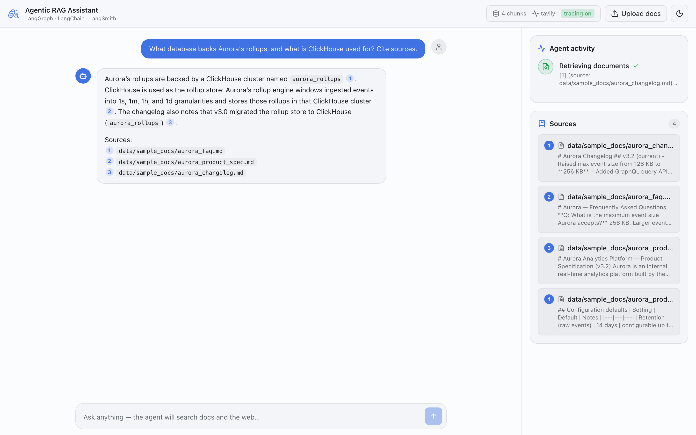
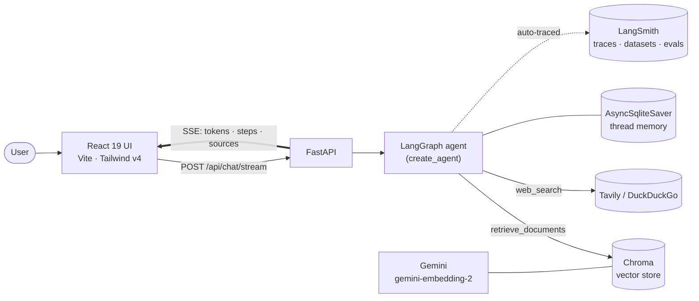
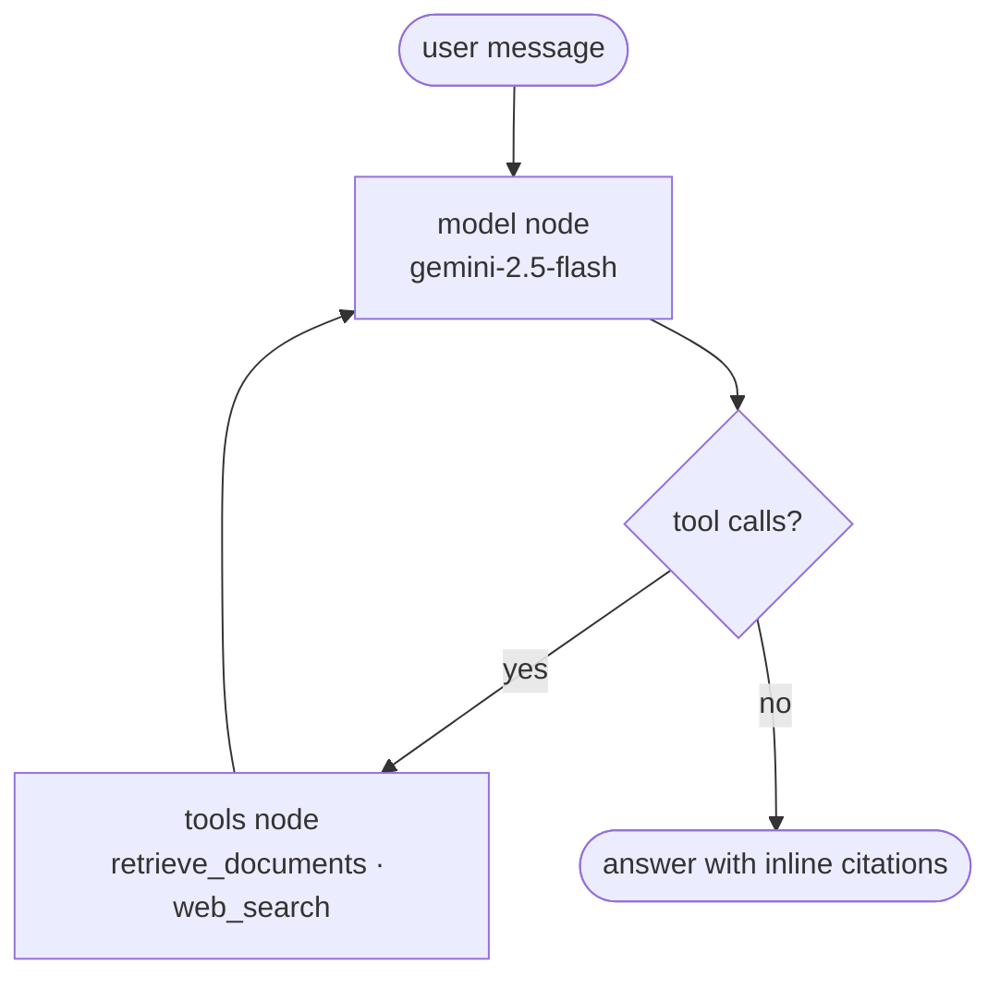
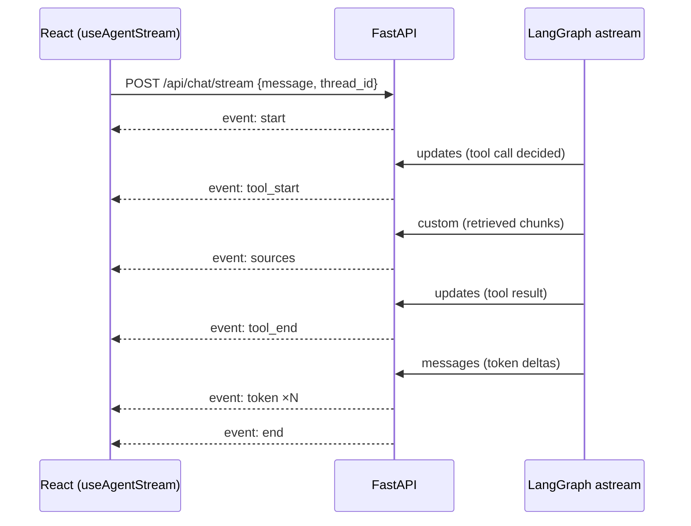

<div align="center">

# 🧠 Agentic RAG Assistant

### An agent that researches your documents **and** the live web — streaming every token and every step to a polished React UI, fully traced and evaluated in LangSmith.

[](https://www.python.org/)
[](https://fastapi.tiangolo.com/)
[](https://python.langchain.com/)
[](https://langchain-ai.github.io/langgraph/)
[](https://smith.langchain.com/) <br/>
[](https://react.dev/)
[](https://www.typescriptlang.org/)
[](https://tailwindcss.com/)
[](https://www.docker.com/)

<br/>


</div>

---

A single-user demo of an **agentic RAG** system built on **LangChain + LangGraph + LangSmith**. A LangGraph agent plans, calls tools (vector retrieval over your documents and live web search), and synthesizes an answer with inline citations. Both the answer tokens **and** the agent's intermediate steps stream to a React 19 UI over Server-Sent Events, while every run is automatically traced and offline-evaluated in LangSmith.

## ✨ Highlights

* 🤖 **Agentic loop, not a fixed chain** — a LangGraph `create_agent` ReAct agent decides when to retrieve documents, when to search the web, and when it has enough to answer.
* 📚 **Dual retrieval** — RAG over a persisted Chroma vector store **+** live web search (Tavily, with a keyless DuckDuckGo fallback).
* ⚡ **Streams tokens *and* steps** — a custom multi-channel `astream` → SSE bridge surfaces token deltas, tool start/stop, and retrieved sources in real time.
* 🪄 **SOTA UI** — React 19 + Vite + Tailwind v4: live agent-activity timeline, clickable `[n]` citation chips, drag-and-drop ingestion, markdown + syntax-highlighted answers, dark mode.
* 🔬 **Real evaluation suite** — a LangSmith dataset scored by LLM-as-judge correctness, RAG groundedness & retrieval-relevance, and a citation heuristic, plus a pairwise model comparison.
* 🐳 **One command to run** — `docker compose up` brings up the backend and a single-origin nginx-served frontend.

This is a single-user/private deployment. The document collection and conversation memory are stored in
the application's local persistent storage; this project does not provide multi-user isolation.

## 🖼️ Screenshots

| Light                                         | Dark                                         |
| --------------------------------------------- | -------------------------------------------- |
|  |  |

The right-hand inspector shows the **agent activity timeline** (each tool call with running → done state) and the **sources** panel; inline `[1]`,`[2]` chips in the latest answer jump to the matching source card.

## 🏗️ Architecture


```mermaid
flowchart LR
    U([User]) --> FE["React 19 UI<br/>Vite · Tailwind v4"]
    FE -- "POST /api/chat/stream" --> API[FastAPI]
    API == "SSE: tokens · steps · sources" ==> FE
    API --> AG["LangGraph agent<br/>(create_agent)"]
    AG -->|retrieve_documents| VS[("Chroma<br/>vector store")]
    AG -->|web_search| WEB[("Tavily / DuckDuckGo")]
    AG --- MEM[("AsyncSqliteSaver<br/>thread memory")]
    EMB["Gemini<br/>gemini-embedding-2"] --- VS
    AG -. auto-traced .-> LS[("LangSmith<br/>traces · datasets · evals")]
```

### Agent control flow (the ReAct loop)


```mermaid
flowchart TD
    S([user message]) --> M["model node<br/>gemini-2.5-flash"]
    M --> D{tool calls?}
    D -->|yes| T["tools node<br/>retrieve_documents · web_search"]
    T --> M
    D -->|no| E([answer with inline citations])
```

`create_agent` compiles exactly this graph. It loops the model ↔ tools edge until the model emits a final answer with no further tool calls — that is the "agentic" behaviour, as opposed to a one-shot retrieve-then-generate chain.

### Streaming contract

The backend runs `agent.astream(stream_mode=["messages", "updates", "custom"])` and maps each channel to a flat SSE event the frontend can consume without knowing any LangGraph internals.


```mermaid
sequenceDiagram
    participant FE as React (useAgentStream)
    participant API as FastAPI
    participant AG as LangGraph astream
    FE->>API: POST /api/chat/stream {message, thread_id}
    API-->>FE: event: start
    AG->>API: updates (tool call decided)
    API-->>FE: event: tool_start
    AG->>API: custom (retrieved chunks)
    API-->>FE: event: sources
    AG->>API: updates (tool result)
    API-->>FE: event: tool_end
    AG->>API: messages (token deltas)
    API-->>FE: event: token ×N
    API-->>FE: event: end
```

| Event        | Channel    | Payload                                                           |
| ------------ | ---------- | ----------------------------------------------------------------- |
| `start`      | —          | `{ thread_id }`                                                   |
| `token`      | `messages` | `{ delta, node }` — incremental answer text                       |
| `tool_start` | `updates`  | `{ id, tool, args }`                                              |
| `tool_end`   | `updates`  | `{ id, tool, ok, result_preview }`                                |
| `sources`    | `custom`   | `{ tool, sources: [{ id, number, kind, title, url?, snippet, score? }] }` |
| `error`      | —          | `{ message, fatal }`                                              |
| `end`        | —          | `{ thread_id }`                                                   |

**Citation numbers.** Each source's `number` is assigned by the backend. It starts at 1 for every user message and keeps counting across all tool calls in that turn (including tools that run in parallel). The same number is printed next to each result in the text the model reads and shown on the matching source card, so `[n]` in the answer matches card `n`. That makes each number identify exactly one source within its turn; it does not ensure the model cites the right passage or only uses numbers from the current turn. `score` is only present for Tavily web results. After a fatal `error` the server still sends `end`, and the UI keeps the error status.

## 🧰 Tech stack

| Layer                     | Stack                                                                                                               |
| ------------------------- | ------------------------------------------------------------------------------------------------------------------- |
| **Agent / orchestration** | LangGraph 1.2 (`create_agent`, `AsyncSqliteSaver`), LangChain 1.3                                                   |
| **LLMs**                  | Google Gemini **`gemini-2.5-flash`** (agent reasoning) + **`gemini-2.5-flash-lite`** (fast model, compared against it in the pairwise evals); `gemini-embedding-2` |
| **Retrieval**             | Chroma 1.5 (persisted) · `RecursiveCharacterTextSplitter` · Tavily / DuckDuckGo                                     |
| **Observability**         | LangSmith 0.8 tracing · `openevals` LLM-as-judge                                                                    |
| **Backend**               | FastAPI · `sse-starlette` · pydantic-settings · uv · Python 3.12                                                    |
| **Frontend**              | React 19 · Vite 8 · TypeScript 6 · Tailwind v4 · Shiki · lucide-react                                               |
| **Delivery**              | Docker Compose (backend + nginx single-origin proxy)                                                                |

## 🚀 Quickstart

Clone this repository using its GitHub URL:

```bash
git clone https://github.com/UtkarshRai14/agentic-rag-assistant
cd agentic-rag-assistant
cp .env.example .env
```

Fill in the required environment variables, including `GOOGLE_API_KEY`. `TAVILY_API_KEY` and the LangSmith variables are optional.
Set `APP_AUTH_PASSWORD` and a long random `AUTH_SECRET` for the single-user login. Keep `AUTH_COOKIE_SECURE=false`
for local HTTP development and set it to `true` behind HTTPS. `FRONTEND_ORIGIN` must match the browser origin
(the Docker frontend defaults to `http://localhost:8080`).

### Docker (recommended)

```bash
export GOOGLE_API_KEY=...
docker compose up -d --build
# UI:   http://localhost:8080
# API:  http://localhost:8000/api/health
docker compose logs -f backend
docker compose down
```

The frontend container serves the built UI and proxies `/api` to the backend. The backend still restricts CORS
to `FRONTEND_ORIGIN` for direct browser access.

Uploads are limited to 10 PDF/TXT/Markdown files per request and 10 MiB per file. Documents with the same
content are indexed only once (SHA-256 content hash), including identical files inside one upload.
Each document's source name is its original filename (Chroma data created by an older version keeps the
names it was indexed with until it is rebuilt).

Chroma and SQLite are persisted in the Docker `state` volume. Keep that volume (or the equivalent local
directories) when upgrading or restarting the application; ephemeral/serverless deployments can lose the
document index and conversation memory. The current design is intended for one application instance and
one authenticated user, not horizontal scaling or multi-user isolation.

### Local dev

```bash
# backend
uv sync
uv run uvicorn rag_agent.api:app --reload          # :8000

# frontend (separate terminal)
cd frontend && npm install && npm run dev          # :5173, proxies /api → :8000
```

On first boot the backend ingests `data/sample_docs/` (a fictional "Aurora" analytics platform) into a persisted Chroma store. Add your own PDF/TXT/Markdown via the **Upload docs** button.

## ⚙️ Configuration

<details>
<summary>Environment variables</summary>

| Variable              | Required | Default                           | Purpose                                                       |
| --------------------- | -------- | --------------------------------- | ------------------------------------------------------------- |
| `GOOGLE_API_KEY`      | ✅        | —                                 | Gemini LLMs + embeddings                                      |
| `APP_AUTH_PASSWORD`   | ✅        | —                                 | Single-user application password                              |
| `AUTH_SECRET`         | ✅        | —                                 | Secret used to sign the HttpOnly session cookie               |
| `AUTH_COOKIE_SECURE`  | ➖        | `false`                           | Set `true` behind HTTPS so the session cookie is `Secure`     |
| `FRONTEND_ORIGIN`     | ➖        | `http://localhost:8080`           | Allowed browser origin (CORS)                                 |
| `TAVILY_API_KEY`      | ➖        | —                                 | Web search (uses keyless DuckDuckGo if unset)                 |
| `LANGSMITH_TRACING`   | ➖        | `false`                           | Master switch for tracing                                     |
| `LANGSMITH_API_KEY`   | ➖        | —                                 | LangSmith auth (tracing + evals)                              |
| `LANGSMITH_PROJECT`   | ➖        | `resume-demo-rag-agent`           | Trace project name                                            |
| `LANGSMITH_ENDPOINT`  | ➖        | `https://api.smith.langchain.com` | LangSmith API endpoint                                        |
| `MODEL_FAST`          | ➖        | `gemini-2.5-flash-lite`           | Fast model, used for the pairwise evaluation comparison       |
| `MODEL_HEAVY`         | ➖        | `gemini-2.5-flash`                | Agent planning / answer synthesis model                       |
| `EMBEDDING_MODEL`     | ➖        | `gemini-embedding-2`              | Embeddings                                                    |
| `CHROMA_DIR`          | ➖        | `./chroma_db`                     | Chroma persistence directory (`/app/state/chroma_db` in Docker Compose) |
| `CHROMA_COLLECTION`   | ➖        | `documents`                       | Chroma collection name                                        |
| `SQLITE_PATH`         | ➖        | `./memory.sqlite`                 | Conversation memory file (`/app/state/memory.sqlite` in Docker Compose) |
| `SAMPLE_DOCS_DIR`     | ➖        | `./data/sample_docs`              | Documents ingested on first boot when the index is empty      |
| `RETRIEVER_K`         | ➖        | `4`                               | Chunks retrieved per query                                    |
| `MAX_UPLOAD_BYTES`    | ➖        | `10485760`                        | Maximum bytes per uploaded file                               |
| `MAX_UPLOAD_COUNT`    | ➖        | `10`                              | Maximum files per upload request                              |
| `VITE_API_URL`        | ➖        | same-origin                       | Deployed backend URL (frontend build-time setting)            |

</details>

## 🔌 API

| Method | Path               | Description                                            |
| ------ | ------------------ | ------------------------------------------------------ |
| `GET`  | `/api/health`      | models, web backend, tracing flag, indexed-chunk count |
| `POST` | `/api/auth/login`  | establish the single-user HttpOnly session cookie     |
| `GET`  | `/api/auth/session` | `200` if the session cookie is valid, `401` otherwise |
| `POST` | `/api/ingest`      | authenticated multipart upload → `{ chunks_added, files }` |
| `POST` | `/api/chat/stream` | authenticated SSE stream (see the streaming contract above) |
| `POST` | `/api/feedback`    | authenticated score for a LangSmith `run_id` (API only; the UI does not call it) |

The chat, ingest and feedback endpoints need the session cookie, so log in first:

```bash
curl -c cookies.txt -X POST http://localhost:8000/api/auth/login \
  -H 'Content-Type: application/json' \
  -d '{"password":"<APP_AUTH_PASSWORD>"}'

curl -N -b cookies.txt -X POST http://localhost:8000/api/chat/stream \
  -H 'Content-Type: application/json' \
  -d '{"message":"What auth does Aurora use, and what is mTLS? Cite sources."}'
```

## 🔬 Observability & Evaluation (LangSmith)

Tracing turns on automatically when `LANGSMITH_TRACING=true` and `LANGSMITH_API_KEY` are set — every LLM call, tool call, and graph node is captured as one nested trace with token counts and latency. **Zero code changes** (`@traceable` is reserved for non-LangChain helpers).

```bash
uv run python -m evals.create_dataset
uv run python -m evals.run_evals
uv run python -m evals.run_pairwise
```

### Example/local results

The evaluation suite is an optional LangSmith harness. It runs example questions with LLM judges and can
compare the configured fast and heavy models. The values below are example/local results from a prior run,
not a production benchmark or guarantee of answer quality. Running the dataset script repeatedly does not
add duplicate questions.

| Evaluator             |   Score  | What it measures                                          |
| --------------------- | :------: | --------------------------------------------------------- |
| `correctness`         | **1.00** | LLM-as-judge vs. reference answer (openevals)             |
| `retrieval_relevance` | **0.92** | retrieved context relevant to the question (RAG)          |
| `groundedness`        | **0.75** | answer supported by retrieved context (RAG faithfulness)* |
| `cites_sources`       | **1.00** | answer actually cites its sources (heuristic)             |

* Below 1.0 by design — the dataset includes general-knowledge questions answered via web search, which have no document context to be "grounded" against.

`run_pairwise` runs the dataset against two models and an LLM preference judge, producing a side-by-side comparison view.

## 🎯 What this project demonstrates

| Capability           | Where it shows up                                                                            |
| -------------------- | -------------------------------------------------------------------------------------------- |
| **LangGraph agents** | `create_agent` ReAct loop, `AsyncSqliteSaver` per-`thread_id` memory, multi-mode `astream`   |
| **Custom streaming** | mapping `messages`/`updates`/`custom` channels → a clean SSE contract for the UI             |
| **RAG engineering**  | loaders → chunking → embeddings → Chroma → retriever tool with source attribution            |
| **LLM evaluation**   | LangSmith datasets, LLM-as-judge + RAG metrics, custom evaluators, pairwise experiments      |
| **Async backend**    | FastAPI lifespan-managed agent, streaming `EventSourceResponse`, blocking ingestion run in a worker thread |
| **Modern frontend**  | React 19 + TS streaming hook (`fetch` + `ReadableStream`), Tailwind v4, dark mode              |
| **Delivery**         | reproducible uv + Docker Compose, single-origin nginx proxy, secrets via env                 |

## 📂 Project structure

```text
src/rag_agent/        FastAPI app + LangGraph agent
  ├─ agent.py         create_agent + system prompt
  ├─ tools.py         retrieve_documents (RAG) + web_search (Tavily/DDG) + citation numbering
  ├─ streaming.py     astream → SSE event mapping
  ├─ api.py           /health /auth /ingest /chat/stream /feedback
  ├─ ingest.py        loaders → splitter → Chroma
  └─ config.py,llms.py,embeddings.py,vectorstore.py,schemas.py

frontend/             React 19 + Vite + Tailwind v4
  └─ src/hooks/useAgentStream.ts   ← the streaming state machine
  └─ src/lib/sse.ts                ← POST-SSE parser

evals/                LangSmith dataset + evaluation scripts
data/sample_docs/     demo corpus (auto-ingested on first boot)
docker-compose.yml    backend (uvicorn) + frontend (nginx)
```

## 🧩 Engineering notes & design decisions

* **`create_agent`, not a hand-rolled `StateGraph`** — the scenario *is* a tool-calling ReAct loop, so the prebuilt agent is the right altitude; it stays fully traceable and streamable.
* **Tool events come from the `updates` channel, not `messages`** — streamed tool-call *argument* deltas are unreliable, so `tool_start`/`tool_end` are derived from completed node updates while answer text streams from `messages`.
* **SSE, not WebSockets** — the data flow is one-directional server→client, so SSE is simpler. The frontend uses `fetch` + `ReadableStream` rather than `EventSource` so it can POST a JSON body; that means the browser does not automatically reconnect if the stream drops.
* **Reasoning-model care** — the heavy model is Gemini (via `langchain-google-genai`); `max_tokens` is left unset so reasoning tokens don't truncate the answer.
* **Per-turn citation numbers** — each chat turn creates a small `SourceCounter` and passes it to the tools through the LangGraph run config, so tools running in the same turn (even in parallel) share one counter while separate requests never do. Numbers are attached to the sources in the backend rather than derived from list position in the UI.
* **Web-search fallback** — web search uses Tavily when `TAVILY_API_KEY` is set and keyless DuckDuckGo otherwise (chosen at startup, not per request). If a search call fails, for either provider, the tool logs the error on the server and returns a short "temporarily unavailable" message to the agent, which decides how to continue; the stream is not interrupted and no error details reach the client.

## 🗺️ Roadmap

* Hybrid (dense + BM25) retrieval and a cross-encoder reranking step
* Token-level streaming citations (highlight sources as they're used)
* Online evaluation and in-UI thumbs up/down wired to `/api/feedback` (the endpoint exists; the UI does not use it yet)
* Multi-user auth and per-user document collections
